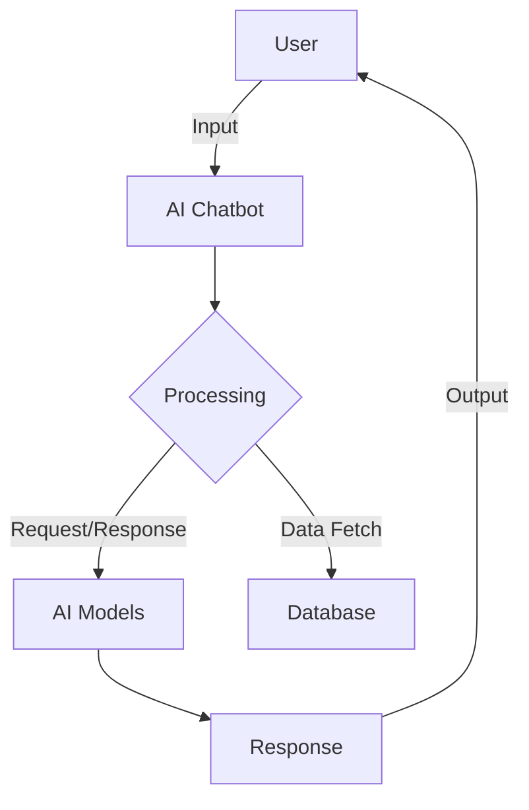

```mermaid
graph TD;
    A[User] -->|Input| B[AI Chatbot]
    B --> C{Processing}
    C -->|Request/Response| D[AI Models]
    C -->|Data Fetch| E[Database]
    D --> F[Response]
    F -->|Output| A
```